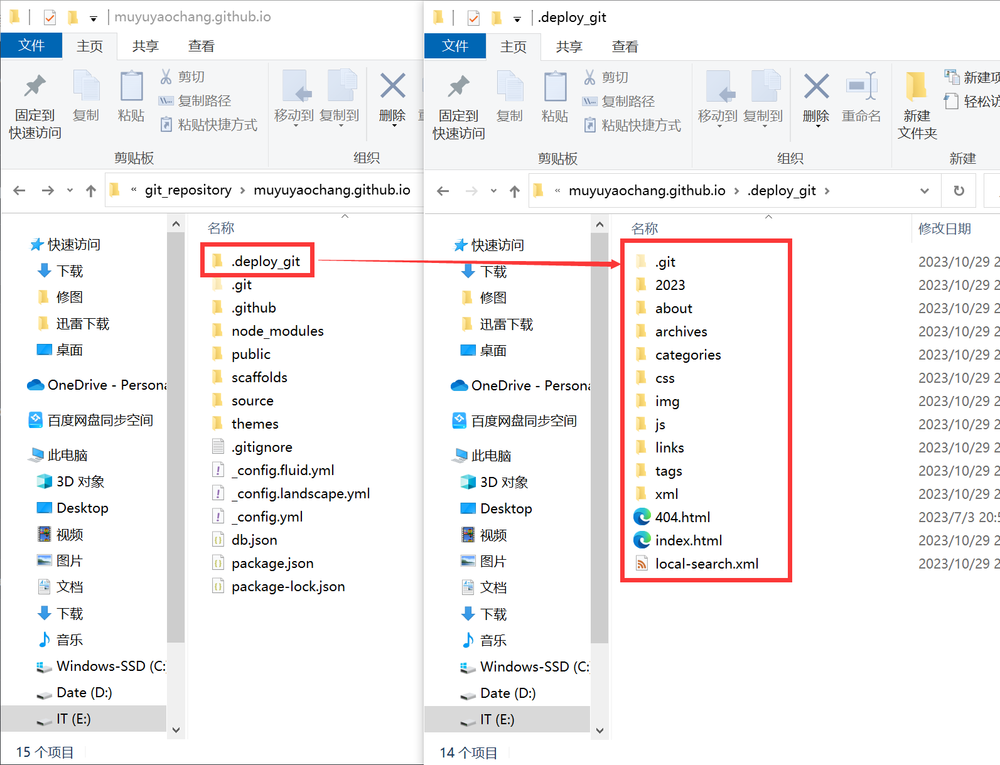
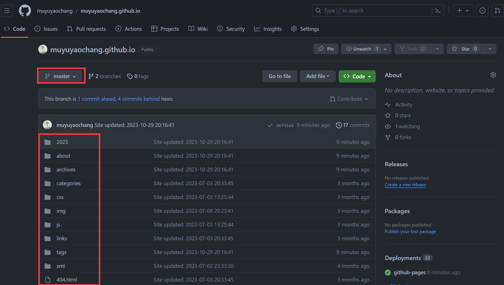
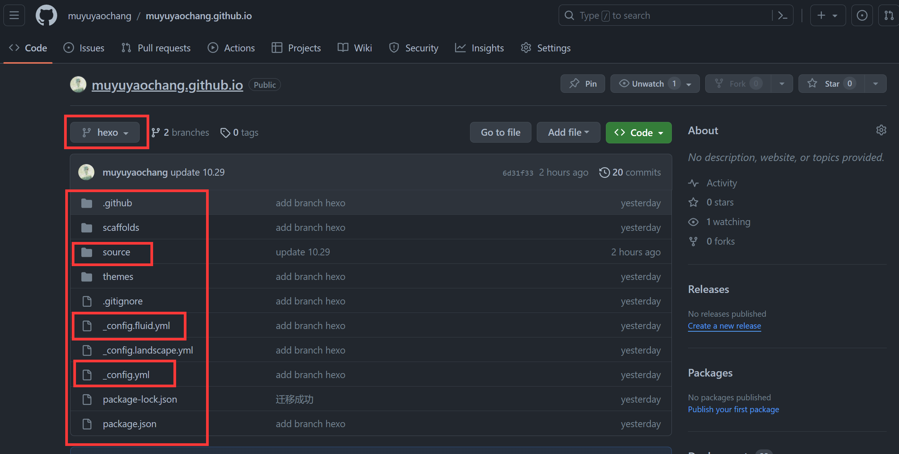
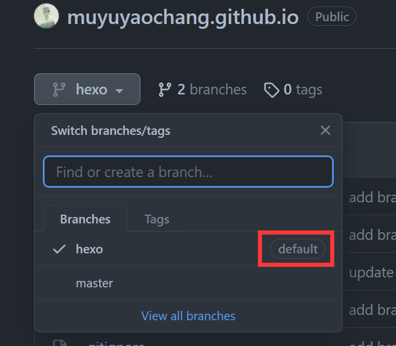

​	前段时间因为学习ROS,安装了Windows10+Ubuntu Desktop双系统，在一段时间的使用后感觉个人更喜欢Ubuntu的开发环境，遂生出将Hexo博客工作流同步到Ubuntu上的想法。经过资料搜索后，Fangzh的一篇博文介绍了一种基于git多分支控制的博客工作流多端同步的方法。



📌本文内容大多直接来自博文[^1]，感谢作者提供的解决方法。


## 方案介绍

在我们每次通过`hexo g`命令将本地源文件编译生成`静态资源文件`（也就是网页文件）之后，我们还需要通过`hexo d`命令将`静态资源文件`（文件夹`.deploy_git`内）部署到之前教程中配置的远程地址进行托管（在本教程中为github仓库中的`master`分支）。

但是除了`.deploy_git`文件夹，如我们保存博客文章和图片的source文件夹、配置文件、主题等，都未同步到github远程仓库中。若将所以文件同步到主分支中，会干扰默认设置的`github action`自动部署到`github page`。

基于以上情况，我们可以在github仓库中再创建一个`hexo`分支，用于同步hexo所需的工程源文件。

## 方案总结

两个分支：

- `master`分支，每次更新博客时输入`hexo d`，自动将生成的网页文件（隐藏文件夹`.deploy_git`内）进行同步到github仓库的master分支，进行`github action`通过`github page`自动部署。也就是我们在网页访问博客所看到的网页内容。

- `hexo`分支，需要hexo工作流同步时自己手动同步到github仓库的hexo分支，每次基于其所同步的hexo工程源文件进行`hexo g`编译生成和`hexo d`部署。

## 具体步骤

### Step 1 github仓库分支设置

> 设置新分支`hexo`，并将其设置为默认分支（方便每次手动同步工程源文件，用于部署的`.deploy_git`文件夹会在`hexo d`后自动部署到github远程仓库的master分支中，我们在一开始建站时的配置文件中配置了）

### Step 2 将工程源文件上传到hexo分支中

### Step 3 新电脑（新系统）配置Hexo环境，并同步工作流

### Tips

- 工作流同步时需手动上传
- 安装Hexo基础环境时，请尽量保证同步的新电脑（新系统）与之前环境中`Nodejs`和`npm`版本一致，否则hexo可能会出现各种问题

## 参考

[^1]: http://fangzh.top/2018/2018090715/
[^2]: 参考资料2
