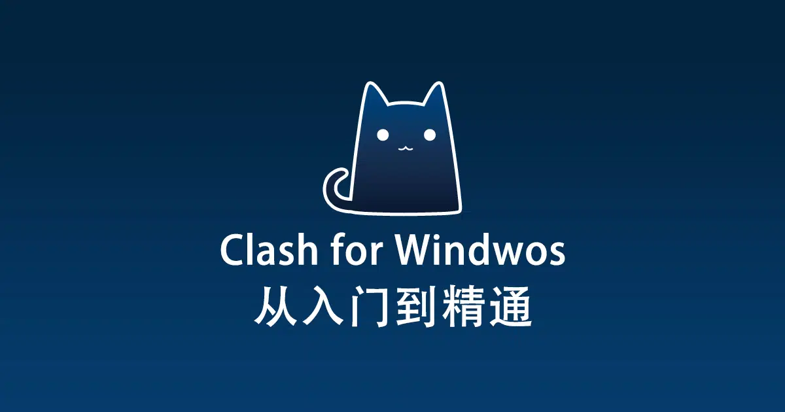
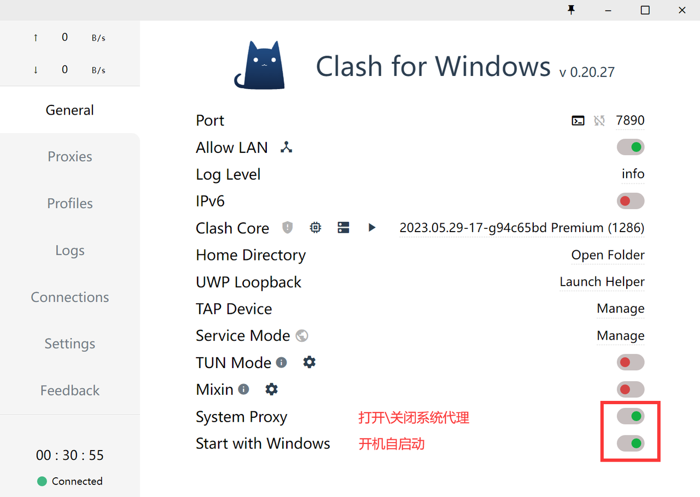
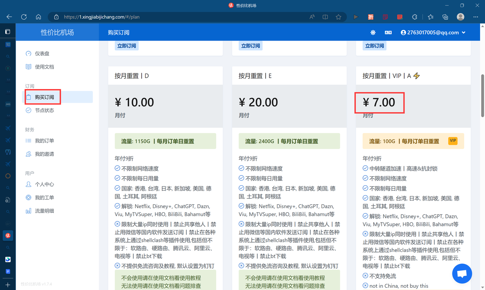
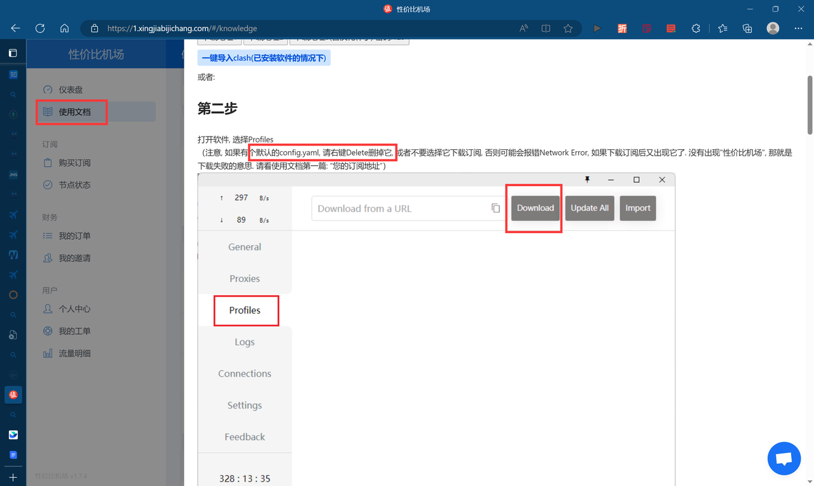
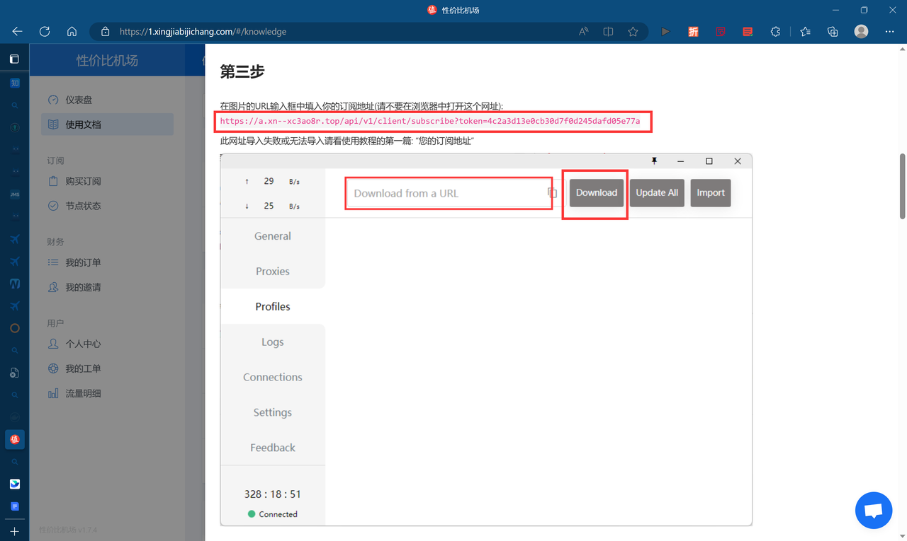
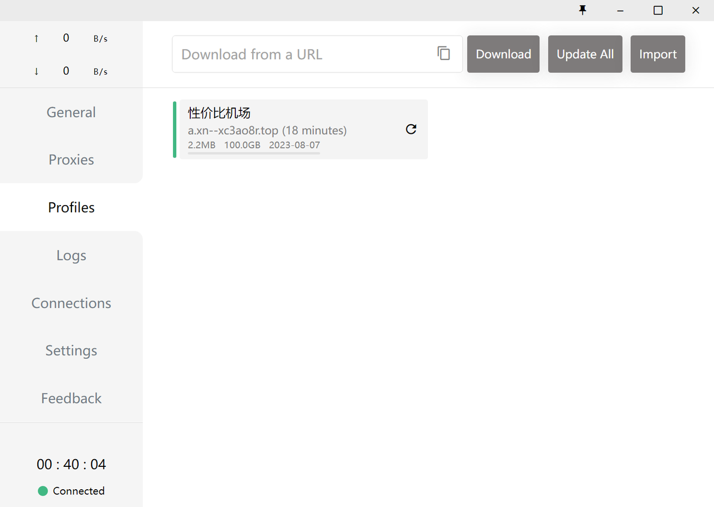

## 准备工作

### 1.Clash for Windows

**Clash for Windows**[^1]是一个使用Go语言编写，基于规则的跨平台代理软件核心程序，目前支持的平台有Windows、Linux、MacOS三大平台。

**Clash for Windows**是代理工具Clash在Windows系统的唯一图形客户端，同时还支持Windows、Linux、macOS三大系统，功能强大且支持多种代理协议，如Shadowsocks(SS)、ShadowsocksR(SSR)、Socks、Snell、V2Ray、Trojan等代理协议。

>   Clash for Windows 官网 Github 项目地址：https://github.com/Fndroid/clash_for_windows_pkg

通俗点说，就是“老翁逾墙走”的“逾墙”工具，能让你看看墙外的网络世界，仅此而已。当然还需配合代理服务商提供的服务才能实现“逾墙”功能。

### 2.代理服务商

**性价比机场**

-   常规注册登录[^2]，内有使用教程。
-   ￥7/month的套餐，对于大部分人来说够用
-   一般使用来说，足够稳定

## 安装配置

### step1：下载压缩包

在官网[Clash for Windows](https://clashforwindows.org/)中选择对应环境及版本进行下载安装。



📌

在官网中有安装包和压缩包两种安装方式，但本人在使用安装包无法正常安装，遂使用压缩包解压方式安装。

且非必要不汉化（软件内涉及的英文不多，多用几次就熟练了，能避免很多未知问题）



### step2：进行解压安装



 ❗ 解压路径中不要出现中文及空格


将压缩包解压到目标目录中。运行`Clash for Windows.exe`文件即可。

### step3：购买套餐

￥7/month的套餐，对于大部分人来说够用，每月100G流量，只要不是每天在外网刷4,5个小时视频大多数都是够用的。

### step4：配置代理服务

按照代理服务提供商的教程文档进行配置服务即可：

1.在Clash for windows 中删除默认配置文件

2.将下面那个链接复制进行下载。

如下即代理服务配置完成，打开系统代理即可尝试“逾墙”测试是否成功。

## 补充

### ChatGPT

openai账号使用谷歌邮箱注册，后续需要手机号验证（中国手机号不可），使用某宝￥20的外国手机号（一次性）验证，客服发验证码注册即可。

有时登录ChatGPT会显示你已经被屏蔽，原因大概是使用的代理服务IP被ChatGPT记录并屏蔽，可以尝试一下将浏览器缓存删除并切换代理线路或者直接无痕浏览并切换线路。

### 代理服务

在使用其他下载服务时（如pip、npm等）报错，请检查系统设置里的代理服务是否关闭。

## 参考

[^1]: [Clash for Windows 官网地址 - Clash for Windows](https://clashforwindows.org/clash-for-windows-official/)
[^2]: [性价比机场 (xingjiabijichang.com)](https://1.xingjiabijichang.com/#/login)
[^3]: [can](https://hiif.ong/clash/)
